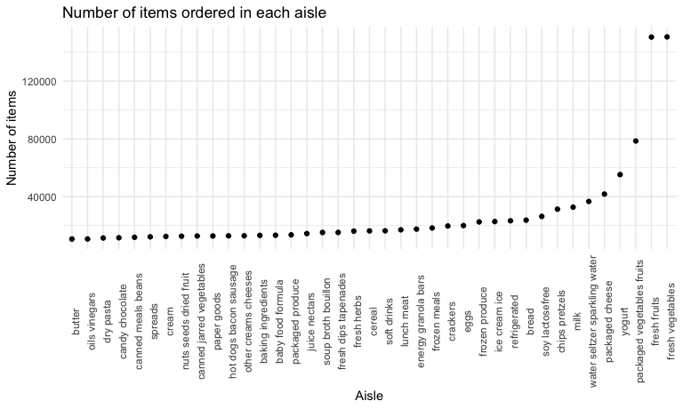
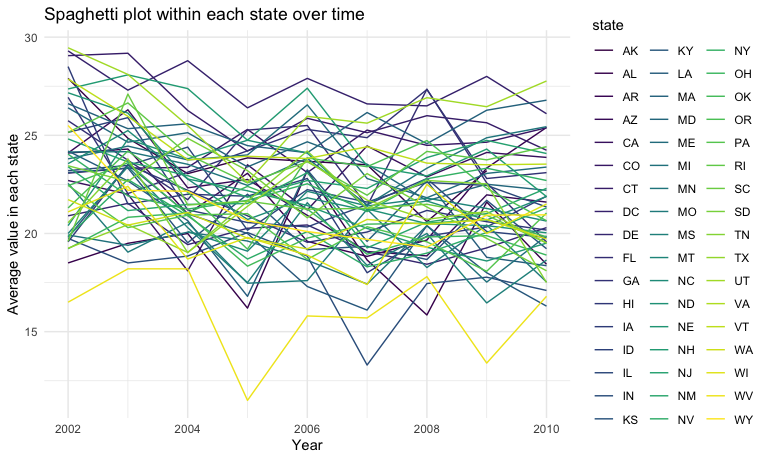
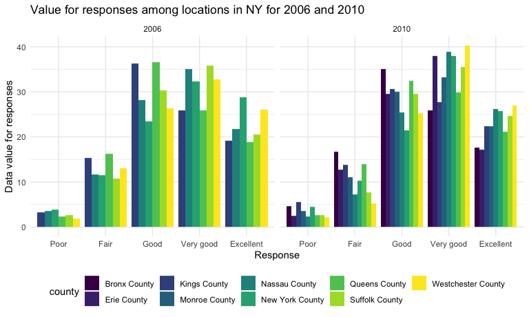
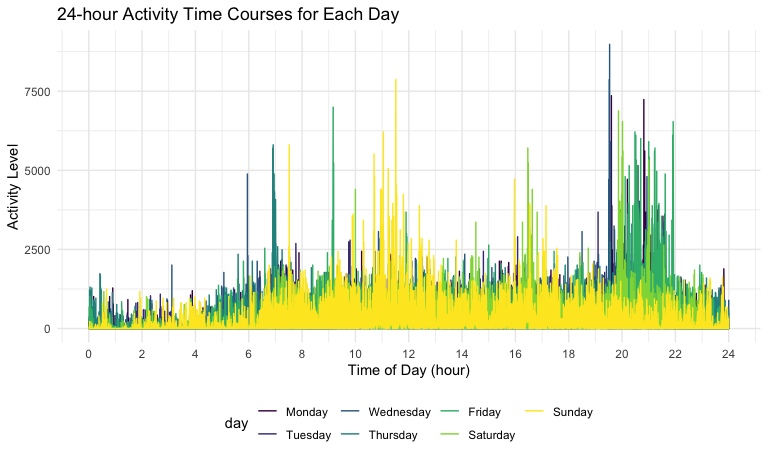

p8105\_hw3\_wq2160
================
Wenshan Qu (wq2160)
10/18/2021

Initial Display Settings

``` r
knitr::opts_chunk$set(
  fig.width = 8,
  fig.asp = .6,
  out.width = "90%"
)

theme_set(theme_minimal() + theme(legend.position = "bottom"))

options(
  ggplot2.continuous.colour = "viridis",
  ggplot2.continuous.fill = "viridis"
)

scale_colour_discrete = scale_colour_viridis_d
scale_fill_discrete = scale_fill_viridis_d
```

## Problem 1

load the `instacart` data.

``` r
library(p8105.datasets)
data("instacart")
```

**Description**

This data set contains 131209 orders information, with 1384617 rows and
15 columns. The key variables in this data set including order\_id,
product\_id, add\_to\_cart\_order, reordered, user\_id, eval\_set,
order\_number, order\_dow, order\_hour\_of\_day,
days\_since\_prior\_order, product\_name, aisle\_id, department\_id,
aisle, department.

To give a simple example on how to illustrate this chart, we could take
the order with id = 1. For this order, number of 8 items was purchased,
with item names Bulgarian Yogurt, Organic 4% Milk Fat Whole Milk Cottage
Cheese, Organic Celery Hearts, Cucumber Kirby, Lightly Smoked Sardines
in Olive Oil, Bag of Organic Bananas, Organic Hass Avocado, Organic
Whole String Cheese and item id 49302, 11109, 10246, 49683, 43633,
13176, 47209, 22035. For these items, the aisle\_id, department\_id and
aisle name were provided to locate the product. Also, we can get the
information fo the customer purchase behavior, such as the order these
items were added to the cart, purchase time, times and intervals of
reordering each item.

**1.1 Aisle information**

``` r
instacart %>% 
  count(aisle) %>% 
    arrange(desc(n))
```

    ## # A tibble: 134 × 2
    ##    aisle                              n
    ##    <chr>                          <int>
    ##  1 fresh vegetables              150609
    ##  2 fresh fruits                  150473
    ##  3 packaged vegetables fruits     78493
    ##  4 yogurt                         55240
    ##  5 packaged cheese                41699
    ##  6 water seltzer sparkling water  36617
    ##  7 milk                           32644
    ##  8 chips pretzels                 31269
    ##  9 soy lactosefree                26240
    ## 10 bread                          23635
    ## # … with 124 more rows

There are 134 aisles, and the most items are ordered from the **fresh
vegetables** aisle. “fresh fruits”, “packaged vegetables fruits” and
“yogurt” are also popular aisles.

**1.2 Aisle plot**

``` r
instacart %>% 
  count(aisle) %>% 
  filter(n > 10000) %>% 
  mutate(
    aisle = factor(aisle),
    aisle = fct_reorder(aisle, n)
  ) %>% 
  ggplot(aes(x = aisle, y = n)) +
  geom_point() +
  theme(axis.text.x = element_text(angle = 90)) +
  labs(
    title = "Number of items ordered in each aisle",
    x = "Aisle",
    y = "Number of items"
  )
```



**1.3 Popular product in aisles**

``` r
aisle_df = 
  instacart %>% 
  filter(aisle %in% c("baking ingredients", "dog food care", "packaged vegetables fruits")) %>% 
  group_by(aisle) %>% 
  count(product_name) %>% 
  arrange(aisle, desc(n)) %>% 
  filter(row_number() <= 3) %>% 
  rename(most_popular_product = product_name, ordered_times = n) %>% 
  knitr::kable(digits = 2)

aisle_df
```

| aisle                      | most\_popular\_product                        | ordered\_times |
|:---------------------------|:----------------------------------------------|---------------:|
| baking ingredients         | Light Brown Sugar                             |            499 |
| baking ingredients         | Pure Baking Soda                              |            387 |
| baking ingredients         | Cane Sugar                                    |            336 |
| dog food care              | Snack Sticks Chicken & Rice Recipe Dog Treats |             30 |
| dog food care              | Organix Chicken & Brown Rice Recipe           |             28 |
| dog food care              | Small Dog Biscuits                            |             26 |
| packaged vegetables fruits | Organic Baby Spinach                          |           9784 |
| packaged vegetables fruits | Organic Raspberries                           |           5546 |
| packaged vegetables fruits | Organic Blueberries                           |           4966 |

**1.4 Product and day**

``` r
day_df = 
  instacart %>% 
  filter(product_name %in% c("Pink Lady Apples", "Coffee Ice Cream")) %>% 
  group_by(product_name, order_dow) %>% 
  summarize(
    mean_hour = mean(order_hour_of_day)
  ) %>% 
  mutate(
    order_dow = recode(order_dow, "0" = "Sunday", "1" = "Monday", "2" = "Tuesday", "3" = "Wednesday", "4" = "Thursday", "5" = "Friday", "6" = "Saturday")
  ) %>% 
  pivot_wider(
    names_from = "order_dow",
    values_from = "mean_hour"
  ) %>% 
  knitr::kable(digits = 2)

day_df
```

| product\_name    | Sunday | Monday | Tuesday | Wednesday | Thursday | Friday | Saturday |
|:-----------------|-------:|-------:|--------:|----------:|---------:|-------:|---------:|
| Coffee Ice Cream |  13.77 |  14.32 |   15.38 |     15.32 |    15.22 |  12.26 |    13.83 |
| Pink Lady Apples |  13.44 |  11.36 |   11.70 |     14.25 |    11.55 |  12.78 |    11.94 |

## Problem 2

Load the data set `BRFSS`.

``` r
data("brfss_smart2010")
```

**2.1 Data cleaning**

``` r
tidy_brfss = 
  brfss_smart2010 %>% 
  janitor::clean_names() %>% 
  filter(topic == "Overall Health") %>% 
  drop_na(response) %>% ## Except 5 responses, there are only null value, so we use drop_na.
  mutate(
    response = factor(response),
    response = fct_relevel(response, "Poor", "Fair", "Good", "Very good", "Excellent")
  ) %>% 
  arrange(response)

tidy_brfss
```

    ## # A tibble: 10,625 × 23
    ##     year locationabbr locationdesc  class  topic  question  response sample_size
    ##    <int> <chr>        <chr>         <chr>  <chr>  <chr>     <fct>          <int>
    ##  1  2010 AL           AL - Jeffers… Healt… Overa… How is y… Poor              45
    ##  2  2010 AL           AL - Mobile … Healt… Overa… How is y… Poor              66
    ##  3  2010 AL           AL - Tuscalo… Healt… Overa… How is y… Poor              35
    ##  4  2010 AZ           AZ - Maricop… Healt… Overa… How is y… Poor              62
    ##  5  2010 AZ           AZ - Pima Co… Healt… Overa… How is y… Poor              49
    ##  6  2010 AZ           AZ - Pinal C… Healt… Overa… How is y… Poor              30
    ##  7  2010 AR           AR - Benton … Healt… Overa… How is y… Poor              21
    ##  8  2010 AR           AR - Pulaski… Healt… Overa… How is y… Poor              36
    ##  9  2010 AR           AR - Washing… Healt… Overa… How is y… Poor              16
    ## 10  2010 CA           CA - Alameda… Healt… Overa… How is y… Poor              23
    ## # … with 10,615 more rows, and 15 more variables: data_value <dbl>,
    ## #   confidence_limit_low <dbl>, confidence_limit_high <dbl>,
    ## #   display_order <int>, data_value_unit <chr>, data_value_type <chr>,
    ## #   data_value_footnote_symbol <chr>, data_value_footnote <chr>,
    ## #   data_source <chr>, class_id <chr>, topic_id <chr>, location_id <chr>,
    ## #   question_id <chr>, respid <chr>, geo_location <chr>

**2.2 2002 locations**

``` r
state_obs_2002 = 
  tidy_brfss %>% 
  filter(year == "2002") %>% 
  group_by(locationabbr) %>% 
  summarize(county = n_distinct(locationdesc)) %>% 
  filter(county >= 7) %>% 
  knitr::kable(aligh = "c")

state_obs_2002
```

| locationabbr | county |
|:-------------|-------:|
| CT           |      7 |
| FL           |      7 |
| MA           |      8 |
| NC           |      7 |
| NJ           |      8 |
| PA           |     10 |

In 2002, 6 states including CT, FL, MA, NC, NJ and PA were observed at 7
or more locations.

``` r
state_obs_2010 = 
  tidy_brfss %>% 
  filter(year == "2010") %>% 
  group_by(locationabbr) %>% 
  summarize(county = n_distinct(locationdesc)) %>% 
  filter(county >= 7) %>% 
  knitr::kable(aligh = "c")

state_obs_2010
```

| locationabbr | county |
|:-------------|-------:|
| CA           |     12 |
| CO           |      7 |
| FL           |     41 |
| MA           |      9 |
| MD           |     12 |
| NC           |     12 |
| NE           |     10 |
| NJ           |     19 |
| NY           |      9 |
| OH           |      8 |
| PA           |      7 |
| SC           |      7 |
| TX           |     16 |
| WA           |     10 |

In 2010, 14 states including CA, CO, FL, MA, MD, NC, NE, NJ, NY, OH, PA,
SC, TX and WA were observed at 7 or more locations.

**2.3 Excellent plot**

``` r
tidy_brfss %>% 
  filter(response == "Excellent") %>% 
  group_by(year, locationabbr) %>% 
  summarize(
    state_mean = mean(data_value, na.rm = TRUE)
  ) %>% 
  ggplot(aes(x = year, y = state_mean, color = locationabbr)) +
  geom_line() +
  theme(legend.position = "right") +
  viridis::scale_color_viridis(
    name = "state",
    discrete = TRUE
  ) +
  labs(
    title = "Spaghetti plot within each state over time",
    x = "Year",
    y = "Average value in each state"
  )
```



**2.4 NY state**

``` r
tidy_brfss %>% 
  filter(
    locationabbr == "NY",
    year %in% c(2006, 2010)
  ) %>% 
  rename(state = locationabbr, county = locationdesc) %>% 
  mutate(county = substring(county, 6)) %>% 
  group_by(year, county) %>% 
  ggplot(aes(x = response, y = data_value, fill = county)) +
  geom_col(position = "dodge") +
  facet_grid(. ~ year) +
  labs(
    title = "Value for responses among locations in NY for 2006 and 2010",
    x = "Response",
    y = "Data value for responses"
  ) 
```



## Problem 3

**3.1 Tidy data**

``` r
accel_df = 
  read.csv("./accel_data.csv") %>% 
  janitor::clean_names() %>% 
  pivot_longer(
    activity_1:activity_1440,
    names_to = "activity",
    values_to = "observation"
  ) %>% 
  mutate(
    day = factor(day),
    day = fct_relevel(day, "Monday", "Tuesday", "Wednesday", "Thursday", "Friday", "Saturday", "Sunday")
  ) %>% 
  mutate(
    day_type = case_when(
      day %in% c("Monday", "Tuesday", "Wednesday", "Thursday", "Friday") ~ "Weekday",
      day %in% c("Saturday", "Sunday") ~ "Weekend"
    )
  ) %>% 
  select(week, day_id, day, day_type, everything()) %>% 
  arrange(week, day)

accel_df
```

    ## # A tibble: 50,400 × 6
    ##     week day_id day    day_type activity    observation
    ##    <int>  <int> <fct>  <chr>    <chr>             <dbl>
    ##  1     1      2 Monday Weekday  activity_1            1
    ##  2     1      2 Monday Weekday  activity_2            1
    ##  3     1      2 Monday Weekday  activity_3            1
    ##  4     1      2 Monday Weekday  activity_4            1
    ##  5     1      2 Monday Weekday  activity_5            1
    ##  6     1      2 Monday Weekday  activity_6            1
    ##  7     1      2 Monday Weekday  activity_7            1
    ##  8     1      2 Monday Weekday  activity_8            1
    ##  9     1      2 Monday Weekday  activity_9            1
    ## 10     1      2 Monday Weekday  activity_10           1
    ## # … with 50,390 more rows

There are week, day\_id, day, day\_type, activity, observation 6
variables after tidying the data. We create a new variable “day\_type”
according to “day” values, and we pivoted longer this dataset. Finally,
there are 50400 rows and 6 columns in this dataset. There are 5 weeks,
and in each week, there are 7 days. Also, for each day, there are 1440
observations.

**3.2 Total activity**

``` r
accel_df %>% 
  group_by(week, day) %>% 
  summarize(total_of_day = sum(observation)) %>% 
  pivot_wider(
    names_from = "day", 
    values_from = "total_of_day"
  ) %>% 
  knitr::kable()
```

| week |    Monday |  Tuesday | Wednesday | Thursday |   Friday | Saturday | Sunday |
|-----:|----------:|---------:|----------:|---------:|---------:|---------:|-------:|
|    1 |  78828.07 | 307094.2 |    340115 | 355923.6 | 480542.6 |   376254 | 631105 |
|    2 | 295431.00 | 423245.0 |    440962 | 474048.0 | 568839.0 |   607175 | 422018 |
|    3 | 685910.00 | 381507.0 |    468869 | 371230.0 | 467420.0 |   382928 | 467052 |
|    4 | 409450.00 | 319568.0 |    434460 | 340291.0 | 154049.0 |     1440 | 260617 |
|    5 | 389080.00 | 367824.0 |    445366 | 549658.0 | 620860.0 |     1440 | 138421 |

I could not see apparent trend in this chart.

Little trend has been shown that for the first 3 weeks, weekends have
higher activity than weekdays, while for the 4th and 5th week, this
situation reversed.

What is also worth noticing that for the Saturdays in week 4 and 5, the
sum is 1440, which means for each minute in the day, the observation is
1, which is really uncommon. I assume that the device may collapse
through these 2 days.

And if we view this chart horizontally, there exists a slightly
increasing trend for activity counts from week 1 to week 5.

**3.3 24-hour activity**

``` r
accel_df %>% 
  mutate(
    activity = substring(activity, 10),
    activity = as.integer(activity)
  ) %>% 
  ggplot(aes(x = activity, y = observation, color = day)) +
  geom_line() +
  scale_x_continuous(
    breaks = c(0, 120, 240, 360, 480, 600, 720, 840, 960, 1080, 1200, 1320, 1440),
    labels = c("0", "2", "4", "6", "8", "10", "12", "14", "16", "18", "20", "22", "24")
  ) +
  labs(
        title = "24-hour Activity Time Courses for Each Day ",
        x = "Time of Day (hour)",
        y = "Activity Level"
  ) +
  theme(legend.position = "bottom")
```



We can see from this graph that:

1.  Generally, on weekends, the patient shows lower activity level than
    weekdays, except on Sunday noon around 11:00 AM, there is a
    significantly higher activity level than any other days at this time
    point;

2.  For all the days in a week, the most “active” time for this
    individual appears between 19:00 and 22:00, and the most “inactive”
    time lies betweeen 0:00 to 4:00, which I assume should be attributed
    to the sleep.
